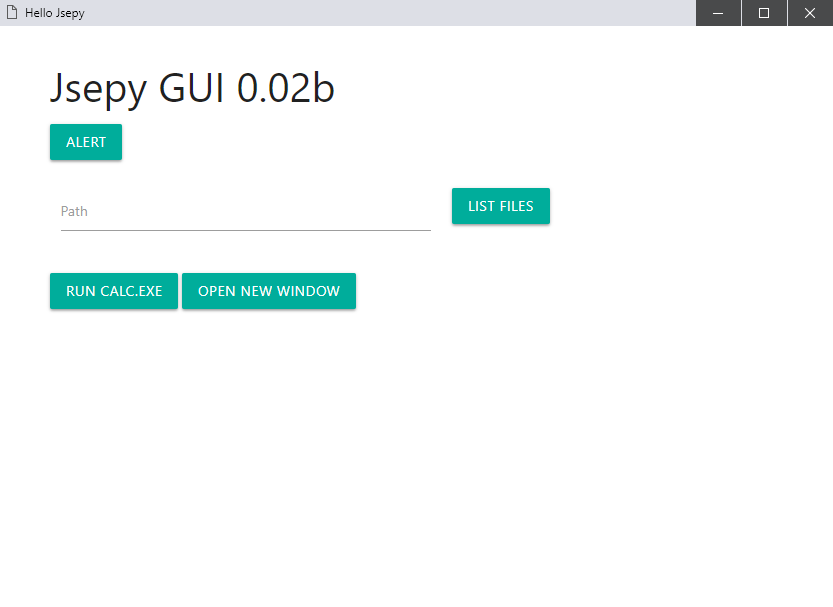

# Jsepy
Jsepy is hybrid GUI framwork using python as backend and HTML/JS/CSS as frontend gui.   
**This framework isn't ready for production it's still in development**

# App route
```
  App : Demo app using Jsepy
    |-> main.html : Main gui window
    |-> export.py : Python code accessable though the linker 
  Jsepy : Main library folder
    |-> server.py : Backend server
    |-> config.py : User config settings including (Export file , Window name , Gui files)
    |-> linkers/  : Files to provide communication between js and python
    |-> helpers/  : Helper python files
 ```
# Demo app

